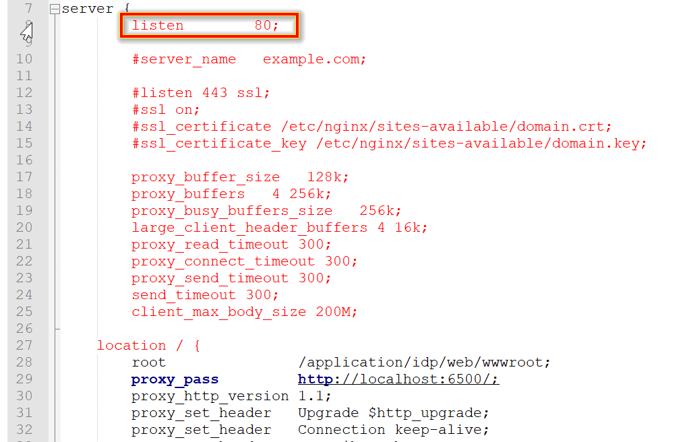

<a href="https://www.boldbi.com"></a>
<br/>
<br/>

[](https://github.com/boldbi/boldbi-docker/releases/latest)
[](https://help.boldbi.com/embedded-bi)
[](https://support.boldbi.com)

# What is Bold BI

Bold BI is a powerful business intelligence dashboard software that helps you to get meaningful insights from your business data and make better decisions.

It is an end-to-end solution for creating, managing, and sharing interactive business dashboards that includes a powerful dashboard designer for composing easily.

With deep embedding, you can interact more with your data and get insights right from your application.

# Supported tags

| Tags               | OS Version    | Last Modified |
| -------------      | ------------- | ------------- |
| `4.2.69`, `latest` | Debian 10  (arm64)    | 04/16/2021 |
| `4.2.69-alpine`    | Alpine 3.13  (arm64)  | 05/17/2021 |
| `4.2.69-focal`     | Ubuntu 20.04  (arm64)       | 05/17/2021 |
|`4.2.69-arm64`|Debian 10 (arm64)|05/17/2021

# How to use this image

## Start a Bold BI instance
<br />
To quickly get started please run below command to run BolBI in your host machine. With this command, you would be able to access the instance from the host without the container’s IP and the standard port mappings.<br/><br/>

```sh
docker run --name boldbi -p 80:80 -d syncfusion/boldbi
```

After running the command, you can access the BoldBI App  via `http://localhost` or `http://host-ip` in a browser. To know more about application startup, refer here.

## Advanced command


```sh
docker run --name boldbi -p 80:80 -p 443:443 \
     -e APP_URL=<app_base_url> \
     -e OPTIONAL_LIBS=<optional_library_names> \
     -e widget_bing_map_enable=<true/false>\
     -e widget_bing_map_api_key=<widget_bing_map_api_key> \
     -v <host_path_for_appdata_files>:/boldbi/app_data \
     -v <host_path_for_nginx_config>:/etc/nginx/sites-available \
     -d syncfusion/boldbi:<tag>
```
### Example for Advanced docker run command

```sh
docker run --name boldbi -p 80:80 -p 443:443 \
     -e APP_URL=https://example.com \
     -e OPTIONAL_LIBS=phantomjs,mongodb,mysql,influxdb,snowflake,oracle,npgsql \
     -e widget_bing_map_enable=true\
     -e widget_bing_map_api_key=<widget_bing_map_api_key> \
     -v D:/boldbi/app_data:/boldbi/app_data \
     -v D:/boldbi/nginx:/etc/nginx/sites-available \
     -d syncfusion/boldbi:4.2.69
``` 

Bold BI accepts the following  environment variables from command line.
| Name                          | Description   | 
| -------------                 | ------------- | 
| `APP_URL`                     | Domain or IP address with http/https protocol.<br/><br/>For example, <br/>`http://<public_DNS_address>`<br/>`http://<public_ip_address>` <br/><br/>The default APP_URL is `http://localhost`<br/> <b>Note:</b><br/>•	If you are using the IP address for the Base URL, make sure you are using the public IP of the machine instead of internal IP or local IP address. Applications can communicate with each other using the public IP alone. Host machine IP will not be accessible inside the application container.<br/>•	You can provide the HTTP or HTTPS scheme for APP_BASE_URL value.| 
|`OPTIONAL_LIBS`|	These are the client libraries used in Bold BI by default.<br/><br/>`'phantomjs,mongodb,mysql,influxdb,snowflake,oracle,npgsql'`<br/><br/>Please refer [Consent to deploy client libraries](docs/consent-to-deploy-client-libraries.md) Libraries section to know more.|
| `widget_bing_map_enable`      | If you need to use Bing Map widget feature, enable this to `true`.<br/>By default this feature will be set to `false`. | 
| `widget_bing_map_api_key`     | API key value for the Bing Map. |
|`<host_path_for_appdata_files>` |Persistent volume path for Bold BI application data|
|`<host_path_for_nginx_config>` |Persistent volume path for Nginx configuration|
<br/>

### Persisting application data

You can store the application data in your host machine to make the Bold BI container a stateful application. Bold BI application will read and write the data in your host machine.
 
Replace the `<host_path_for_appdata_files>` value with a directory path from your host machine in the advanced docker run command.

> **For example**<br/>
> Windows: `-v D:/boldbi/app_data:/boldbi/app_data`<br/>
> Linux: `-v /home/boldbi/app_data:/boldbi/app_data`

### Nginx configuration

You can mount a host directory to Bold BI container for maintaining Nginx configuration. You can also store SSL certificates in this directory and can configure Nginx with them.

Replace the `<host_path_for_nginx_config>` value with a directory path from your host machine in the advanced docker run command.

> **For example**<br/>
> Windows: `-v D:/boldbi/nginx:/etc/nginx/sites-available`<br/>
> Linux: `-v /home/boldbi/nginx:/etc/nginx/sites-available`

Once, the Bold BI container started to run, you can check the directory in your host machine. The `boldbi-nginx-config` file will be generated there. You can configure the Nginx inside the container using this file.


### SSL configuration in Nginx

If you have an SSL certificate for your domain and need to configure the site with your SSL certificate, follow these steps:

1. Uncomment the following marked lines in the **boldbi-nginx-config** file.

    

    

2. Comment the following marked line in the **boldbi-nginx-config** file.

    

3. Replace the example.com with your domain name.

4. Place the certificate and key file in your host directory, which you mounted on the Bold BI application to store Nginx configuration. i.e. The directory path replaced with `<host_path_for_nginx_config>` value in the advanced docker run command. You can update the certificate and key file names in **boldbi-nginx-config** file.

    

> **NOTE:** If you are configuring the application with SSL, then you need to update the `<app_base_url>` in docker run command with `HTTPS`.
<br/>

Docker compose:<br/>
BoldBI in Single container image.
<br/></br>
 BoldBI in multiple container image.
## Start single services Bold BI with `docker-compose`
You can use Docker Compose to easily run Bold BI in an isolated environment built with Docker containers. The image shown here is a single image containing multiple BoldBi services targeted for simplifying evaluation and minimalistic production use cases. Please refer to [this guide](docs/single-image.md) to deploy Bold BI in an simplified docker compose environment with single image.
## Start multiple services Bold BI with `docker-compose`
Bold BI also comes with multiple images for each of the services in it to run on docker-compose which is mainly for the purpose of production environment to scale services within Bold BI.  Please refer to [this guide](docs/Multi-image.md) to get know about the multiple images and compose details to deploy Bold BI in an advanced docker compose environment.
# Application Startup

Configure the Bold BI On-Premise application startup to use the application. Please refer the following link for more details on configuring the application startup.

https://help.boldbi.com/embedded-bi/application-startup

# License

