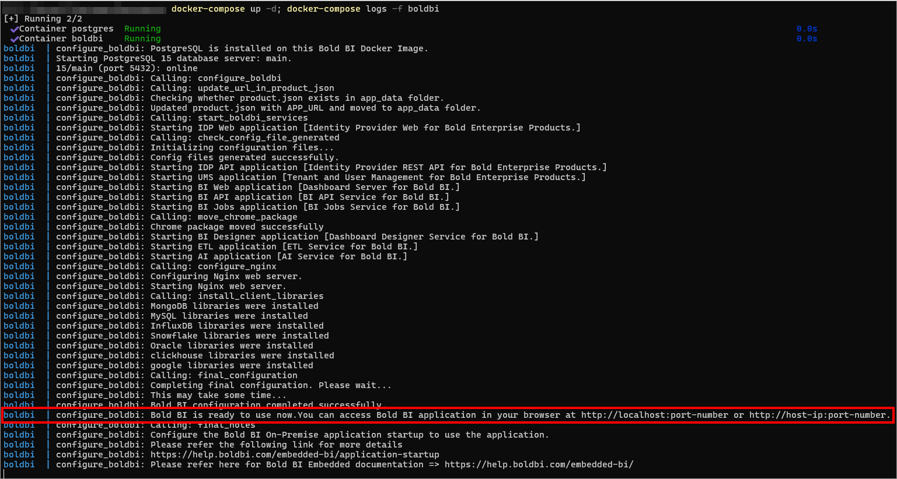
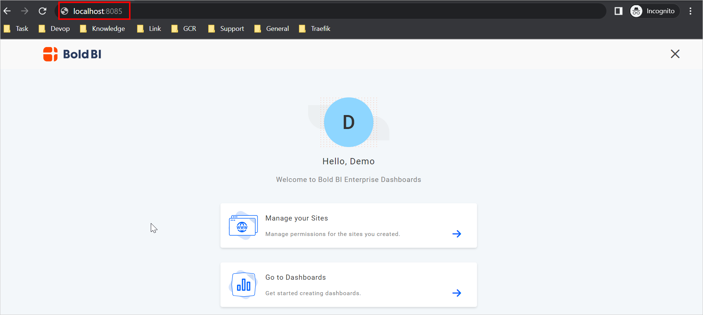

<!-- markdownlint-disable MD033 -->
<!-- markdownlint-disable MD041 -->
<a href="https://www.boldbi.com?utm_source=github&utm_medium=backlinks"></a>
</br>
</br>

[](https://github.com/boldbi/boldbi-docker/releases/latest)
[](https://help.boldbi.com/embedded-bi?utm_source=github&utm_medium=backlinks)
[](https://www.boldbi.com/support?utm_source=github&utm_medium=backlinks)

# What is Bold BI

Bold BI is a powerful business intelligence dashboard software that helps you to get meaningful insights from your business data and make better decisions.

It is an end-to-end solution for creating, managing, and sharing interactive business dashboards that include a powerful dashboard designer for composing easily.

With deep embedding, you can interact more with your data and get insights directly from your application.

# Deployment Prerequisites

## Hardware requirements

The following hardware requirements are necessary to run the Bold BI solution:

* Operating System: Use the Bold BI Docker on the following operating systems:
  * Windows
  * Linux
  * Mac
* CPU: 2-core.
* Memory: 4 GB RAM.
* Disk Space: 8 GB or more.

## Software requirements

The following software requirements are necessary to run the Bold BI Enterprise edition:

* Database: Microsoft SQL Server 2012+ | PostgreSQL | MySQL
* Application: [Docker](https://docs.docker.com/engine/) and [Docker Compose](https://docs.docker.com/compose/).
* Web Browser: Microsoft Edge, Mozilla Firefox, and Chrome.

# Supported tags

| Tags  | OS Version    | Last Modified(MM/DD/YYYY)| Purpose |
| ------------- | ------------- | ------------- | ------------- |
| `9.1.73-eval` | Debian 12  (amd64,arm64) | 01/10/2025 | This Docker image is specifically designed to streamline the Bold BI evaluation process by integrating a PostgreSQL server within the Bold BI container. Please note that this image tag is intended for evaluation purposes only and should not be used in production environments. |
| `9.1.73`, `latest` | Debian 12  (amd64,arm64)    | 01/10/2025 | This tag is intended for production use. Select this variant if you prefer Debian as the base image for your deployment. |
| `9.1.73-alpine`    | Alpine 3.13  (amd64, arm64)  | 01/10/2025 | This tag is intended for production use. Select this variant if you prefer Alpine as the base image for your deployment. |
| `9.1.73-focal`     | Ubuntu 22.04  (amd64, arm64)       | 01/10/2025 | This tag is intended for production use. Select this variant if you prefer Ubuntu as the base image for your deployment. |

**Note**:

* Image and PDF exporting is not supported in ARM architecture images and Alpine variant images.
* Filesystem and Web connectors are not supported in Bold ETL for Alpine variant images.

# How to use this image?

The above Bold BI image can be deployed using Docker or Docker Compose. In the following section, we are going to start the Bold BI application and a separate PostgreSQL instance with volume mounts for data persistence using Docker Compose.

1. Download the Docker Compose file by using the following command.

   ```sh
   curl -o docker-compose.yml "https://raw.githubusercontent.com/boldbi/boldbi-docker/main/deploy/single-container-eval/docker-compose.yml"
   ```

2. Open the Docker Compose file, fill the BOLD_SERVICES_UNLOCK_KEY value, and save it. You can download the offline unlock key from the [Subscriptions](https://www.boldbi.com/account/my-subscriptions?utm_source=github&utm_medium=backlinks) page.

    

3. Run the command below. This command will start the Bold BI and Postgres SQL containers and display the Bold BI logs to provide information about the installation status of the Bold BI application.

   ```sh
   docker-compose up -d; docker-compose logs -f boldbi
   ```

   

4. Now, access the Bold BI application by entering the URL as `http://localhost:8085` or `http://host-ip:8085` in the browser. When opening this URL in the browser, it will configure the application startup in the background and display the page below within a few seconds. The default port number mentioned in the compose file is 8085. If you are making changes to the port number, then you need to use that port number for accessing the Bold BI application.

   

   > **Note:** </br> 1. The deployment steps above are recommended for evaluation purposes only. For a production use case, you will need to mount the volume to the host path location or online storage and utilize managed DB servers. </br>2. Don't use localhost IP (`http://127.0.0.1`) with `port` to access the application.

# How to Deploy Bold BI using Advanced Configuration?

In this section, you will learn how to run the Bold BI application using advanced configurations such as configuring Bold BI using an existing DB server, using a host directory as a persistent volume, configuring startup manually, configuring an SSL certificate, and running a multi-container BI application.

1. [How to deploy Bold BI using existing DB server](docs/how-to-deploy-bold-bi-using-existing-db-server.md)?

2. [How to deploy Bold BI and configure startup manually](docs/how-to-deploy-bold-bi-and-configure-startup-manually.md)?

3. [How to use host path as Persistent Volume](docs/how-to-use-host-path-as-persistent-volume-for-bold-bi-deployment.md)?

4. [How to configure SSL certificate for Bold BI](docs/FAQ/how-to-configure-ssl-for-docker-compose.md)?

5. [How to start multiple containers Bold BI with Docker Compose](docs/multiple-container.md)?

6. [Bold BI supported environment variables and their usage](docs/environment-variable.md)?

# License

[https://www.boldbi.com/terms-of-use#embedded](<https://www.boldbi.com/terms-of-use#embedded?utm_source=github&utm_medium=backlinks>)</br>

The images are provided for your convenience and may contain other software that is licensed differently (Linux system, Bash, and more from the base distribution, along with any direct or indirect dependencies of the Bold BI platform).

These pre-built images are provided for your convenience and include all optional and additional libraries by default. These libraries may be subject to different licenses than the Bold BI product.

If you want to install Bold BI from scratch and precisely control which optional libraries are installed, please download the stand-alone product from boldbi.com. If you have any questions, please contact the Bold BI team ([https://www.boldbi.com/support](<https://www.boldbi.com/support?utm_source=github&utm_medium=backlinks>)).

It is the image user's responsibility to ensure that any use of this image complies with any relevant licenses for all software contained within.

# FAQ

[How to configure SSL for Bold BI application in single container and multiple container?](https://github.com/boldbi/boldbi-docker/blob/main/docs/FAQ/how-to-configure-ssl-for-docker-compose.md)

[How to reset the database for Bold BI application in docker environment?](https://github.com/boldbi/boldbi-docker/blob/main/docs/FAQ/how-to-configure-ssl-for-docker-compose.md)

[How to auto deploy multiple services Bold BI via docker-compose?](https://github.com/boldbi/boldbi-docker/blob/main/docs/FAQ/how-to-auto-deploy-bold-bi-multiple-services-in-docker-compose.md)

[How to upgrade a new image in docker environment using docker compose yaml file?](https://support.boldbi.com/kb/article/462/how-to-upgrade-a-new-image-in-docker-environment-using-docker-compose-yaml-file)

[How to deploy Bold BI on an ECS Fargate cluster using an Application Load Balancer?](https://support.boldbi.com/kb/article/13855/deploy-bold-bi-on-an-ecs-fargate-cluster-using-an-application-load-balancer)
