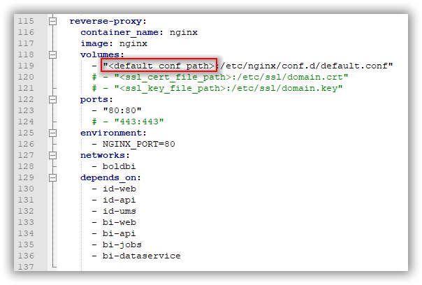

## Run multiple services `Bold BI and Bold Reports` via `docker-compose`

This quick-start guide demonstrates how to use Compose to set up and run Bold BI and Bold Reports as combinational deployment. Before starting, make sure you have [Compose installed](https://docs.docker.com/compose/install/)

### Define the Project

  1. Create an empty project directory.<br/>
  You can name the directory something easy for you to remember. This directory is the context for your application image. This project directory should contains a `docker-compose.yml` file .

  2.  Make and change into your project directory.
  For example, if you named your directory `my_bold_services`

      ```sh
      $  cd my_bold_services/
      ```

  3. Download the configuration files [here](/deploy/multiple-container/combinational-deploy/). This directory includes docker-compose YML file and configuration file for Nginx.
  
      > **Tip:**
        You can use either a `.yml` or `.yaml` extension for this file. They both works well.

  4. Replace `<app_base_url>` with your DNS or IP address, by which you want to access the application.
    
      For example, <br/>
          `http://example.com` <br/>
          `https://example.com` <br/>
          `http://<public_ip_address>` <br/>
          `http://host.docker.internal` <br/>

      > **Note:**
      > * If you are using the IP address for the Base URL, make sure you are using the public IP of the machine instead of internal IP or local IP address. Applications can communicate with each other using the public IP alone. Host machine IP will not be accessible inside the application container.
      > * Use http://host.docker.internal instead of http://localhost. Host machine localhost DNS will not be accessible inside the container. So, docker desktop provides `host.docker.internal` and `gateway.docker.internal` DNS for communication between docker applications and host machine. Please make sure that the host.docker.internal DNS has your IPv4 address mapped in your hosts file on Windows(C:\Windows\System32\drivers\etc\hosts) or Linux (/etc/hosts).
      > * Provide the HTTP or HTTPS scheme for APP_BASE_URL value.

<br />

  5. You can also change the Port number other than `8085`

  6. Provide the **default.conf** file path, which you have downloaded earlier in `<default_conf_path>` place.

       For example, <br>`"./default.conf:/etc/nginx/conf.d/default.conf"`<br>
        `"D:/boldbi/docker/default.conf":"/etc/nginx/conf.d/default.conf"`<br>
        `"/var/boldbi/docker/default.conf:/etc/nginx/conf.d/default.conf"`

     

  7. Allocate a directory in your host machine to store the shared folders for applications’ usage. Replace the directory path with `<host_path_boldservices_data>` and `<host_path_db_data>` in **docker-compose.yml** file.

       For example, <br><b>Windows:</b> `device: 'D:/boldbi/boldservices_data'` and `device: 'D:/boldbi/db_data'` <br><b>Linux:</b> `device: '/var/boldbi/boldservices_data'` and `device: '/var/boldbi/db_data'`

      > **Note:**
      > The docker volumes `boldservices_data` and `db_data` persists data of Bold BI and PostgreSQL respectively. [Learn more about docker volumes](https://docs.docker.com/storage/volumes/)
      
   8. If you need to use Bing Map widget feature, enable this to true and enter the API key value for `- widget_bing_map_api_key`. By default this feature will be set to false.
   
      

### Build the project

Now, run `docker-compose up -d` from your project directory.
<br />

This runs `docker-compose up` in detached mode, pulls the needed Docker images, and starts the boldbi and database containers, as shown in the example below.

### Bring up BoldBI in a web browser

At this point, BoldBI should be running in `<app_base_url>:8085` (as appropriate)

> **Note:**
> The BoldBI site is not immediately available on port 8085 because the containers are still being initialized and may take a couple of minutes before the first load.

### Application Startup

1. Configure the Bold BI application startup to use the application. Please refer to the following link for more details on configuring the application startup.
    
   https://help.boldbi.com/embedded-bi/application-startup

2. Navigate to administration configuration file.
   ```sh
   <DNS>/ums/administration/config-editor
   ```
   

3. In product.json file, append the Internal URL for Bold reports services as shown below :

   


5. In product.json and config.json file, append the lines below for Bold Reports:
    ```console
    {
    "Name": "BoldReports",
    "SetupName": "BoldReports_EnterpriseReporting",
    "Version": "9.1.7",
    "IDPVersion": "5.1.8",
    "IsCommonLogin": true
    }
    ```
   >**Note:** The IDP version of Bold BI or Bold Reports should be same.

6. Set `IsCommonLogin` property to be `true` for Bold BI and Bold Reports.
     
   
7. Restart the deployment using the following command to apply the changes:

   ```sh
   docker restart <container name or id>
   ```
8. Refer to the document below to activate the License either by using your login credentials or by an offline unlock key for Bold Reports.
    https://help.boldreports.com/enterprise-reporting/administrator-guide/application-startup/#activate-bold-reports-license

> **Note:**
> To use the above configured PostgreSQL server in Bold BI please use `pgdb` as the PostgreSQL server name.


### Shutdown and cleanup

The command `docker-compose down` removes the containers and default network, but preserves the volumes of Bold BI and PostgreSQL. <br /><br />
The command `docker-compose down --volumes` removes the containers, default network, and all the volumes.